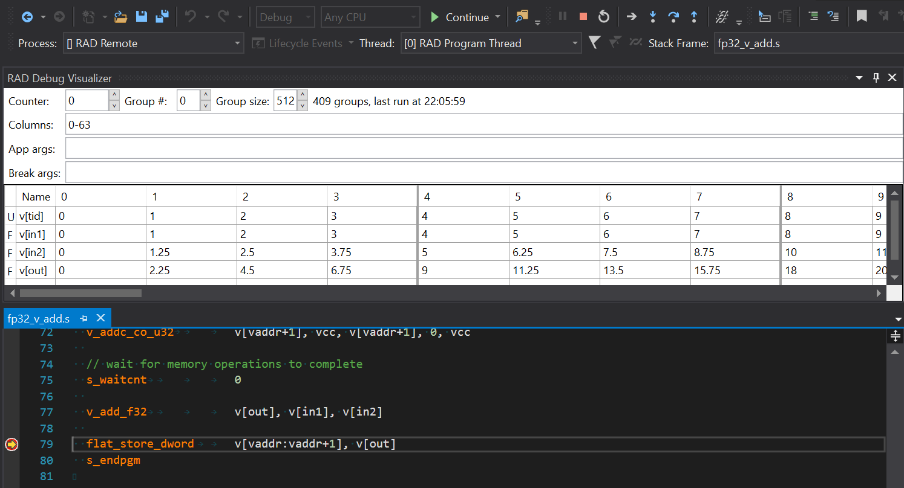
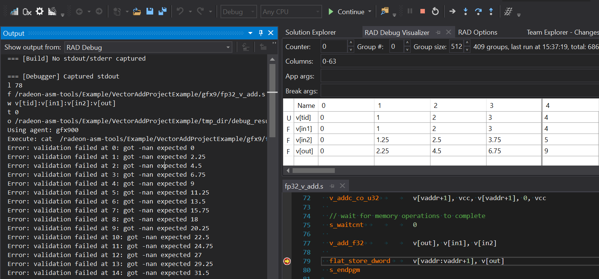

# Debugger Example

## Prerequisites

### Remote Machine

The following software needs to be installed on the machine where the kernels will run:

* [ROCm Platform](https://rocm.github.io/ROCmInstall.html)
* [.NET Core 2.2 Runtime](https://dotnet.microsoft.com/download/dotnet-core/2.2)
* CMake and additional script dependencies:
```sh
sudo apt-get -y install cmake libboost-program-options-dev liblist-moreutils-perl
```

### Host Machine

* Visual Studio 2017/2019
* [RadeonAsmDebugger Extension for Visual Studio](../README.md#Installation)

## Building and Running

### Remote Machine

1. Transfer the `VectorAddProjectExample` directory to the remote machine
2. Create a build directory and run `cmake` followed by `make` there:
```sh
cd VectorAddProjectExample
mkdir build
cd build
cmake ..
make
```
3. Downlad latest [release](https://github.com/vsrad/radeon-asm-tools/releases) and transfer `DebugServerLinux64` directory to the remote machine
4. Navigate to the `/path-to-debug-server/DebugServerLinux64` directory
5. Launch the debug server with `chmod +x RadeonAsmDebugServer && ./RadeonAsmDebugServer`

### Host machine

1. Open `DebuggerProjectExample` in Visual Studio
2. Go to *Tools* -> *RAD Debug* -> *Options*
3. Click the *Edit* button in the opened window to edit the active debug profile
4. In the *Debugger* tab, set *Working Directory* to the absolute path
to `VectorAddProjectExample` on the remote machine
6. Press *Apply* to save the changes and *OK* to close the profile editor
7. Open `fp32_v_add.s` in *Solution Explorer*
8. Set a breakpoint on line 79
9. Start debugging by pressing F5 (alternatively, clicking on the *RAD Debugger* button with a green arrow)
10. Go to *Tools* -> *RAD Debug* -> *Open Visualizer* to open debug visualizer. You should
see the values of watched VGPRs:


## Notes and Remarks

* To troubleshoot errors, open the *Output* window (*View* -> *Output*) and select *RAD Debug* in the *Show output from* dropdown.

* Upon reaching the breakpoint, the host-side will output validation failure messages. This is expected because the kernel execution is aborted at the breakpoint, so no output is written to the destination address.


* If you see *Permissions denied* messages in the output, make sure that the following files have the executable bit set (`chmod +x`):
  - `VectorAddProjectExample/common/debugger/dbg_clang_wrapper.sh`
  - `VectorAddProjectExample/common/debugger/vadd_debug.sh`
  - `VectorAddProjectExample/common/debugger/breakpoint_gcnasm.pl`

* Wave size is hardcoded in this example (see [breakpoint_gcnasm.pl](VectorAddProjectExample/common/debugger/breakpoint_gcnasm.pl#L170)):
    ```
    -   s_mul_i32 s[dbg_soff], s[dbg_soff], wave_size * (1 + $n_var) * 4
    +   s_mul_i32 s[dbg_soff], s[dbg_soff], 64 * (1 + $n_var) * 4
    ```
