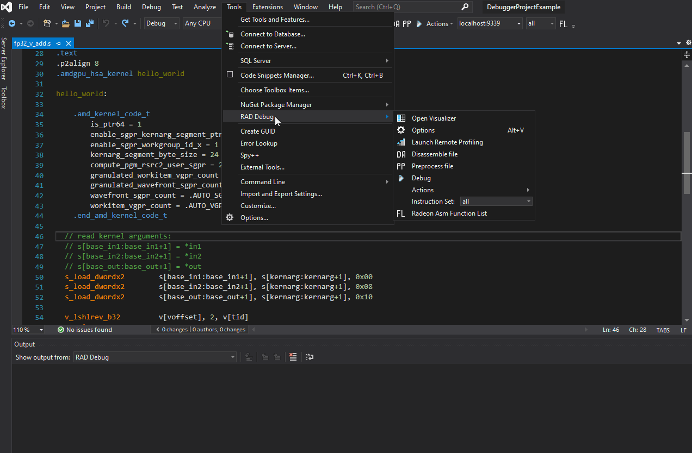
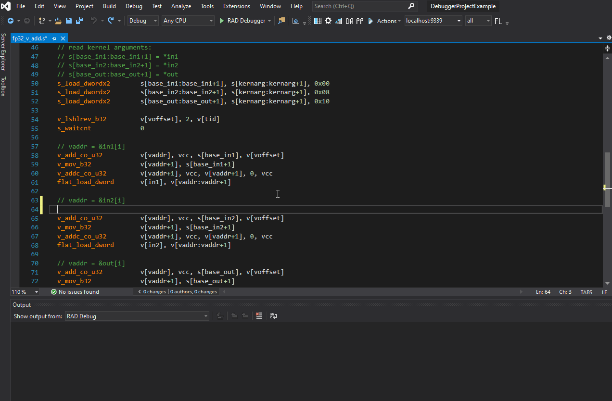
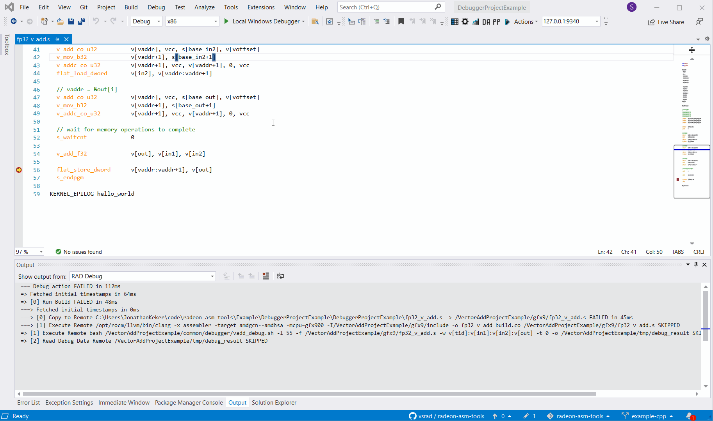
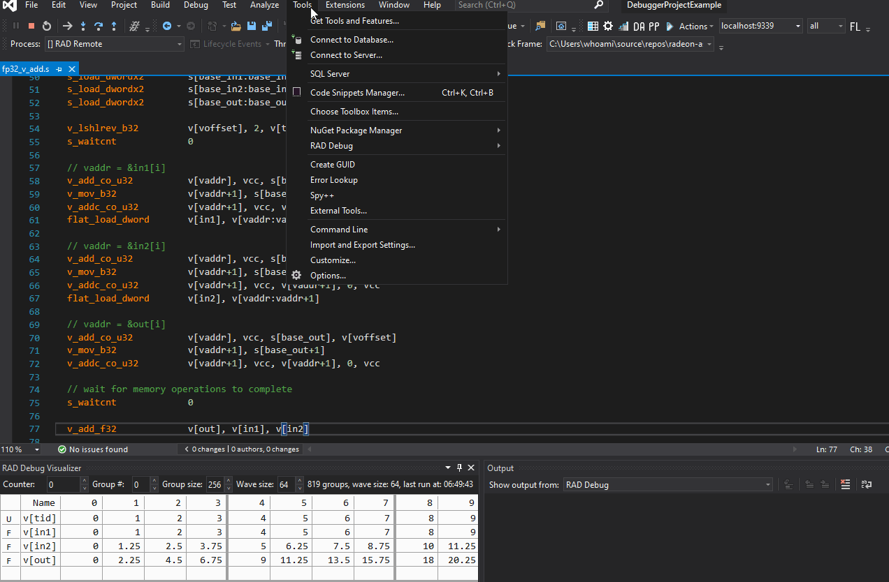
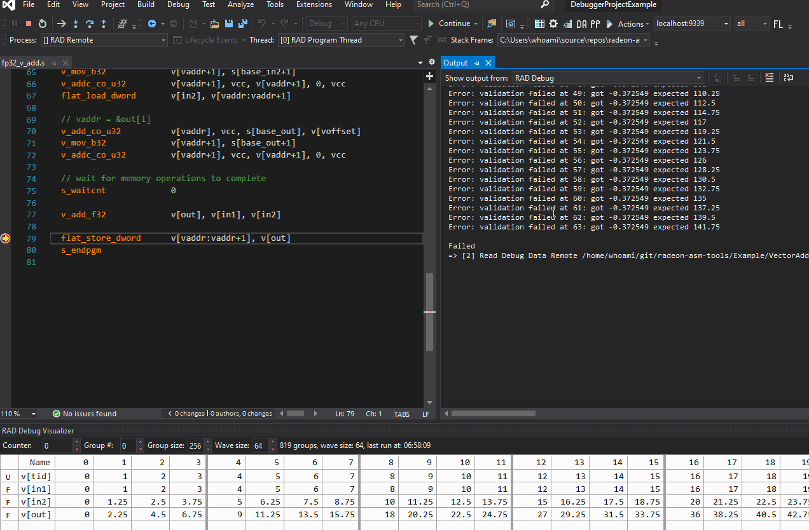

# Debugger Example

## Prerequisites

* Visual Studio 2017/2019
* [RadeonAsmDebugger Extension for Visual Studio](../README.md#Installation)

## Building and Running

### Remote Machine (Docker)

To run the example application without attaching debugger:
```
docker run --device=/dev/kfd --device=/dev/dri --security-opt seccomp=unconfined --group-add video -w /VectorAddProjectExample/gfx9 vsrad/rocm-example ../build/gfx9/fp32_v_add
```

To launch Debug Server:
```
docker run -p 9339:9339 -it --device=/dev/kfd --device=/dev/dri --security-opt seccomp=unconfined --group-add video vsrad/rocm-example ./RadeonAsmDebugServer
```

### Remote Machine (Manual)

#### Prerequisites

* [ROCm Platform](https://rocm.github.io/ROCmInstall.html)
* [.NET Core 3.1 Runtime](https://dotnet.microsoft.com/download/dotnet-core/3.1)
* CMake and additional script dependencies:
```sh
sudo apt-get -y install cmake liblist-moreutils-perl
```

#### Build the Example Application

1. Transfer the `VectorAddProjectExample` directory to the remote machine
2. Create a build directory and run `cmake` followed by `make` there:
```sh
cd VectorAddProjectExample
mkdir build
cd build
cmake ..
make
```

#### Launch Debug Server

1. Downlad the latest [release](https://github.com/vsrad/radeon-asm-tools/releases) and transfer the `DebugServerLinux64` directory to the remote machine
2. Navigate to `DebugServerLinux64` on the remote machine
3. Launch the server with `chmod +x RadeonAsmDebugServer && ./RadeonAsmDebugServer`

### Host machine

1. Open `DebuggerProjectExample` in Visual Studio
2. Go to *Tools* -> *RAD Debug* -> *Options*
3. Click the *Edit* button in the opened window to edit the active debug profile
4. In the *General* tab, set *Remote Machine Address* to the IP address of your remote machine
5. In the *Macro* tab, set *RadDebugWorkDir* to the absolute path
to `VectorAddProjectExample` on the remote machine (`/VectorAddProjectExample` in the **Docker container**)
6. Press *Apply* to save the changes and *OK* to close the profile editor

* **Note:** All RAD buttons can be added to main window: *View* -> *Toolbars* -> *RAD Debug*)

### Build your shader

1. Open `fp32_v_add.s` in *Solution Explorer*
2. Click *Tools* -> *RAD Debug* -> *Actions* -> *Build*
3. Check that the object file `VectorAddProjectExample/fp32_v_add_build.co` is created on the remote machine

* **Note:** when using Docker, the code object can be found at `/VectorAddProjectExample` (execute `docker exec -it containerIdOrName bash` to enter the container)

* To configure build action, navigate to *Tools* -> *RAD Debug* -> *Options* -> *Edit* -> *Actions/Build*
    
* Build errors are displayed in the standard output window (and highlighted in the code if the `RadeonAsmSyntax` extension is installed)
    

### Launch the Debugger

1. Open `fp32_v_add.s` in *Solution Explorer*
2. Set a breakpoint on line 79
3. Start debugging by pressing F5 (alternatively, clicking on the *RAD Debugger* button with a green arrow)
4. Go to *Tools* -> *RAD Debug* -> *Open Visualizer* to open debug visualizer. You should
see the values of watched VGPRs:


* You can set your debug options *Tools* -> *RAD Debug* -> *Options* -> *Edit* -> *Actions/Debug*
    

## Notes and Remarks

* To troubleshoot errors, open the *Output* window (*View* -> *Output*) and select *RAD Debug* in the *Show output from* dropdown.

* Upon reaching the breakpoint, the host-side will output validation failure messages. This is expected because the kernel execution is aborted at the breakpoint, so no output is written to the destination address.


* If you see *Permissions denied* messages in the output, make sure that the following files have the executable bit set (`chmod +x`):
  - `VectorAddProjectExample/common/debugger/dbg_clang_wrapper.sh`
  - `VectorAddProjectExample/common/debugger/vadd_debug.sh`
  - `VectorAddProjectExample/common/debugger/breakpoint_gcnasm.pl`

* Workgroup size is hardcoded in this example (see [breakpoint_gcnasm.pl](VectorAddProjectExample/common/debugger/breakpoint_gcnasm.pl#L129)):
    ```
    -   s_mul_i32 s[dbg_soff], s[\\gidx], waves_in_group
    +   s_mul_i32 s[dbg_soff], s[\\gidx], 1
    ```
* Wave size is hardcoded in this example (see [breakpoint_gcnasm.pl](VectorAddProjectExample/common/debugger/breakpoint_gcnasm.pl#L133)):
    ```
    -   s_mul_i32 s[dbg_soff], s[dbg_soff], wave_size * (1 + $n_var) * 4
    +   s_mul_i32 s[dbg_soff], s[dbg_soff], 64 * (1 + $n_var) * 4
    ```
