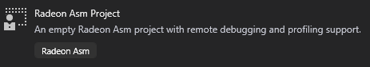
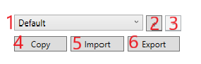

# Radeon Asm Debugger Extension for Visual Studio User Manual

The extension provides the following features:

* [Project template](#project-template)
* [Profiles](#profiles)
* [Remote debugging tools](#remote-debugging-tools)
* Disassembling tools
* Profiling tools
* [Data visualization tools](#data-visualization-tools)
* [Shortcuts](#shortcuts)

## Project Template

To use the tools described below, you must first create a new
`Radeon Asm Project`.

After [installing the extension](README.md#installation), you should see
the project template in the *Create a new project* dialog:



You can find it by selecting `Radeon Asm` in the *Languages* dropdown.

## Profiles

A *profile* is a set of machine-specific settings such as executable paths, network addresses and debugger configuration.

Multiple profiles can be created for a single project and swapped without restarting the IDE or exiting debug mode. This allows you to easily test the same kernel on a number of different platforms. Furthermore, profiles can be exported to a file and imported in other projects (on different workstations).

### Profile Managing

This is the profile managing interface that could be found in `Options -> Edit`



Description:
1. Current profile name and dropdown for choosing current profile.
2. `Add new profile` button.
3. `Remove current profile` button.
4. `Copy`: create new profile based on current one.
5. `Import`: choose profile *.json* file and import all containing profiles.
6. `Export`: create profile *.json* file that will represent all currently set profiles.

The following sections provide an overview of the properties that can be configured in a single profile:

* [General](#general-properties)
* [Debugger](#debugger-properties)
* [Disassembler](#disassembler-properties)
* [Profiler](#profiler-properties)

Other chapters will reference these sections as needed.

### General Properties

* **Profile Name**: name of the current profile.
* **Deploy Directory**: directory on the remote machine where the project is deployed before starting the debugger.
* **Remote Machine Address**: IP address of the remote machine. To debug kernels locally, start the debug server on your local machine and enter `127.0.0.1` in this field.
* **Port**: port on the remote machine the debug server is listening on. (When started without arguments, the server listens on port `9339`)
* **Autosave Source**: specifies whether the source files that are changed should be automatically saved before running remote commands (debug, disassemble, profile, etc.).
  - When set to **None**, no source files are saved automatically.
  - When set to **ActiveDocument**, only the active source file (currently selected in the editor) is automatically saved.
  - When set to **OpenDocuments**, all source files the are open in the editor are automatically saved.
  - When set to **ProjectDocuments**, all source files that belong to the current project are automatically saved.
  - When set to **SolutionDocuments**, all source file that belong to the solution are automatically saved.
* **Additional Sources**: a semicolon-separated list of out-of-project paths that are copied to the remote machine (see **Deploy Directory**).
* **Copy Sources to Remote**: enables or disables remote deployment.

### Debugger Properties

* **Executable**: path to the debugger executable on the remote machine.
* **Arguments**: command-line arguments for **Executable**.
* **Working Directory**: debugger working directory.
* **Output Path**: path to the debug script output file (can be relative to **Working Directory**).
* **Output Mode**: specifies how the debug script output file is parsed:
  - **Text**: each line is read as a hexadecimal string (*0x...*).
  - **Binary**: 4-byte blocks are read as a single dword value.
* **Run As Administrator**: specifies whether the `Executable` is run with administrator rights.
* **Timeout**: debug script execution timeout (in seconds). Once reached, the debug process is terminated. Set to `0` to disable.
* **Parse Valid Watches File**: specifies whether the file specified in **Valid Watches File Path** should be used to filter vald watches.
* **Valid Watches File Path**: path to the file with valid watch names on the remote machine.
* **Output Offset**: `int` number, that indicates
  - if **Output Mode** is `binary`: amount of bytes to skip.
  - if **Output Mode** is `text`: amount of lines to skip.

### Disassembler Properties

* **Executable**: path to the disassembler executable on the remote machine.
* **Arguments**: command-line arguments for **Executable**.
* **Working Directory**: disassembler working directory.
* **Output Path**: path to the disassembler script output file (can be relative to **Working Directory**).
* **Local Path**: path to the file on local machine to copy disassembler output file.
* **Line Marker**: disassemble will search this line in output file and place the cursor on it if this line exists.

### Profiler Properties

* **Executable**: path to the profiler executable on the remote machine.
* **Arguments**: command-line arguments for **Executable**.
* **Working Directory**: profiler working directory.
* **Output Path**: path to the profiler script output file (can be relative to **Working Directory**).
* **Viewer Executable**: path to the viewer executable on the local machine.
* **Viewer Arguments**: command-line arguments for **Viewer Executable**.
* **Local Copy Path**: path to the file on local machine to copy profiler output file.
* **Run As Admin**: specifies whether the `Executable` is run with administrator rights.

## Remote Debugging Tools

**Radeon Asm Debugger Extension** provides tools for kernel debugging using remote machine.

### Prerequisities

* **Visual Studio 2017** or **2019** with installed extension on host machine
* `DebugServer` running on remote machine
* Internet connection between host and remote machines

### Basic concepts

Debugging process is performed in seven steps:

1. Copying source files from host machine to remote
2. Sending information about breakpoint location to `DebugServer`
3. Running debug scripts on remote machine
4. Inserting breakpoint logic to the source code
5. Modidfied code executing
6. Breakpoint logic saves all needed data to a file and terminates code execution
7. `DebugServer` sends the data obtained to the host machine for visualization inside `Visual Studio`

It must be noted that every debugger invocation starts execution of the code from the beginning (for example,
every `Step Into` will perform all seven steps mentioned above with incremented breakpoint line number) due to
the impossibility of continuing code execution from arbitrary state. But this is not an issue because execution
usually doesn't take long (< 1sec.).

### Usage

Once you configured your [profile](#profiles) and added [watches to watchlist](#watches-and-watchlist) you can
start debugging (*F5*).

At first debugger will be in break state, so you can place your breakpoints and press *F11* or `Continue` button
to run debugger.

### Watches and watchlist

In order to evaluate variable you should place it in *Watch list*, so debugger will compute it's value on the
next invocation. There is several ways to do it:
* Open [Debug Visualizer](#data-visualization-tools) and type variable name inside the `Name` cell of the
last empty row of `Visualizer Table`.
* Select text that represents variable name, click on selection with LMB and select `Add To Watches`.
* Click on variable name with LMB and select `Add To Watches`

If you want to add to watches some array range:
* Select text that represents array name, click on selection with LMB, find `Add To Watches As Array` in context
menu and select `From` and `To` parameters.
* Click on array name with LMB, find `Add To Watches As Array` in context menu and select `From` and `To` parameters.

`Add Selection As Array` pastes to *Watch list* several variables represented as array range.

If selected text is `a`, `From` is `5` and `To` is `7` then
```
a[5]
a[6]
a[7]
```
will be added to *Watch list*.

Multidimentional arrays are also supported.

If selected text is `a[0]`, `From` is `5` and `To` is `7` then
```
a[0][5]
a[0][6]
a[0][7]
```
will be added to *Watch list*.

Relative addressation:

If selected text is `a[i]`, `From` is `5` and `To` is `7` then
```
a[i+5]
a[i+6]
a[i+7]
```
will be added to *Watch list*.

## Data visualization tools

## Shortcuts

*Can be customized in `Tools->Options->Keyboard`*

* `Alt+A`: **Add To Watches**

`View->Toolbars->Rad Debug` to enable toolbar that contains:
* `Launch Remote Profiling`
* `Open Visualizer`
* `Options`
* `Disassemble File`