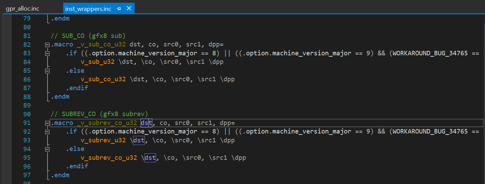
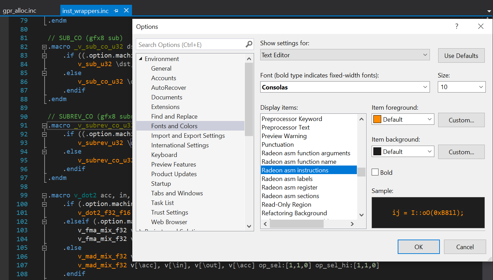
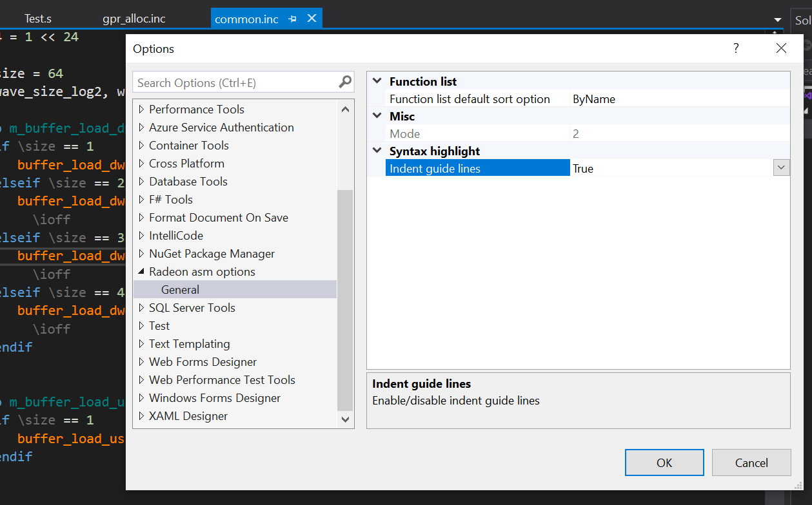
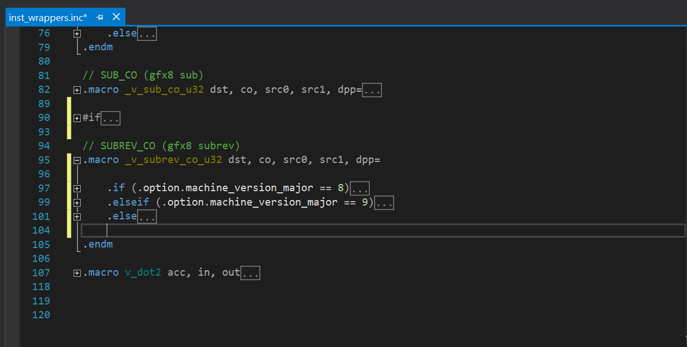
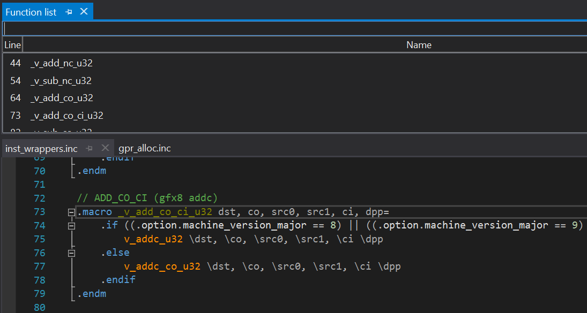
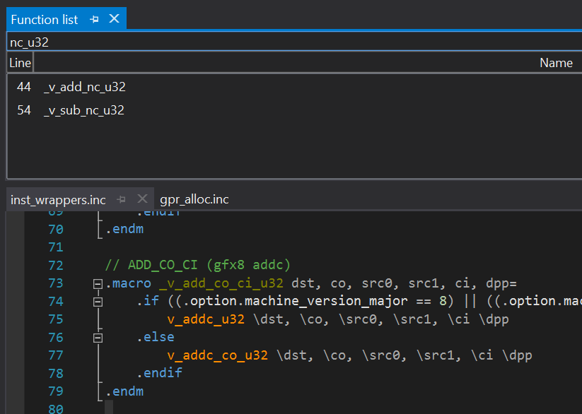
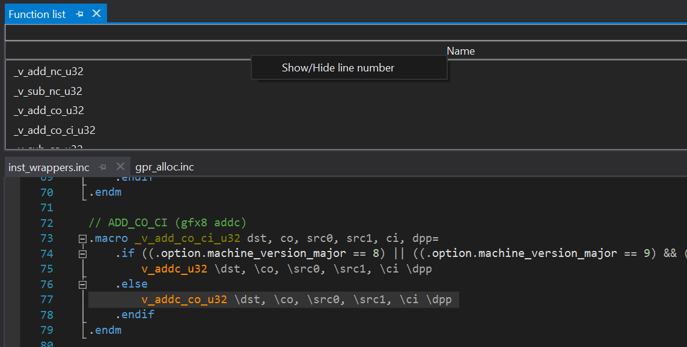
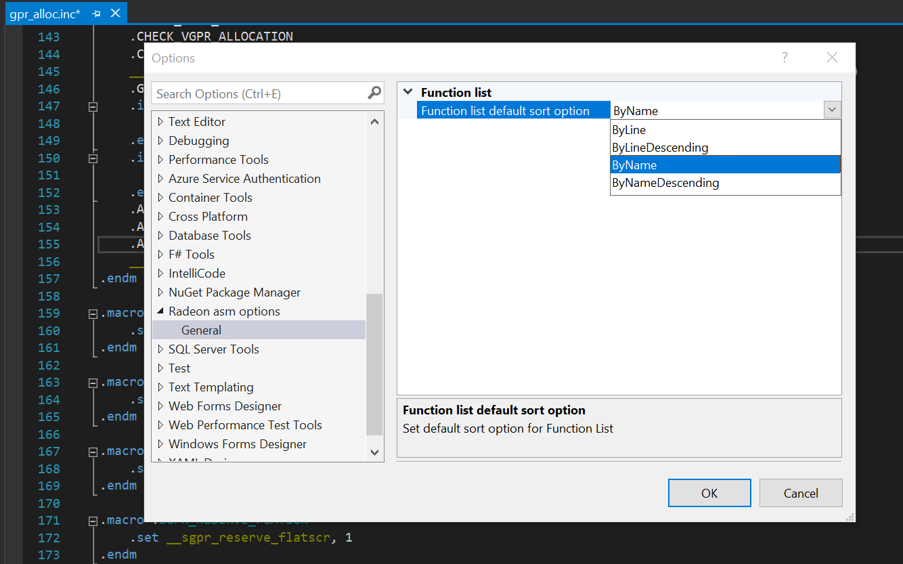
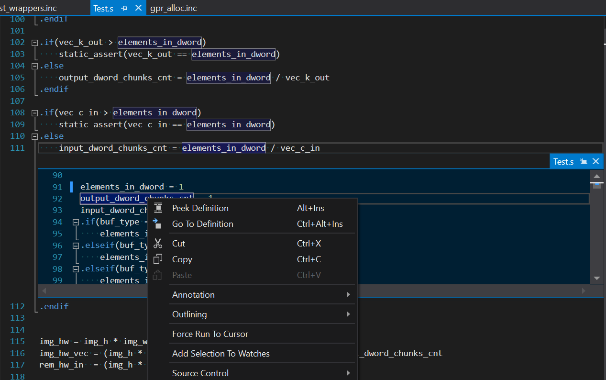
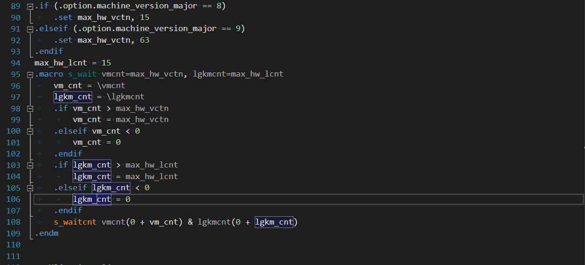

# Visual Studio Radeon Asm Syntax Highlight Extension

## Build Instructions

Make sure you have [.NET Framework SDK 4.8](https://dotnet.microsoft.com/download/visual-studio-sdks) installed on your development workstation.

To build extension you should use one of four project build options:
* `Debug` - debug version with *Radeon asm* support
* `Release` - release version with *Radeon asm* support

> For example, for the `Release` build option, the `RadeonAsmSyntax.vsix` extension installer will be located in the ***path to project location\VSRAD.Syntax\bin\Release*** directory.

## Debugging

1. Right-click on `VSRAD.Syntax` in *Solution Explorer* and select *Set as StartUp Project*.
2. Right-click on `VSRAD.Syntax` in *Solution Explorer* and
select *Properties*.
4. Navigate to the *Debug* tab in the project properties editor.
5. Choose *Start external program* as the *Start action* and enter the path to your Visual Studio executable (`<Visual Studio installation path>\Common7\IDE\devenv.exe`).
6. Close the project properties editor and start debugging by pressing F5.

## Plugin features

### Syntax highlight
#### Radeon asm syntax options
* Radeon asm extra keywords
* Radeon asm function argument
* Radeon asm function name
* Radeon asm identifier dark theme
* Radeon asm identifier light theme
* Radeon asm instructions
* Radeon asm labels

  
  

### Indent guide lines

  
  

### Outlining regions 

### Function list
* Tool window location is `View -> Other Windows -> Radeon Asm Function List`
* The function list is filtered by text in search field.
* Use *Up* or *Down* in order to scroll through the function list.
* Use *Line* or *Name* buttons to sort function list by line number or function name.
* Click *RMB* to **Show/Hide** line number column.
* Use *clear hotkey* to clear the search field. To 
  > To set clear special hotkey: `Tool -> Options -> Environment, Keyboard -> find command "FunctionList.Clear" and set shortcut keys`.
* *Enter*, *redirect hotkey* or *click on the function in list* redirect to a function in code.
  > To set redirect special hotkey: `Tool -> Options -> Environment, Keyboard -> find command "FunctionList.Select" and set shortcut keys`.

  
  

  
  

### Code navigation
* Navigation between project fiels by `#inclide` or `.include` keywords
* Navigation to `macros`
* Navigation to `variable` (variable definition is explicit `.set` or implicit `vaiable_name = 0x01`)
* Navigation to `macro argument`

### Identifier highlight
* Highlighting an element in its scope

